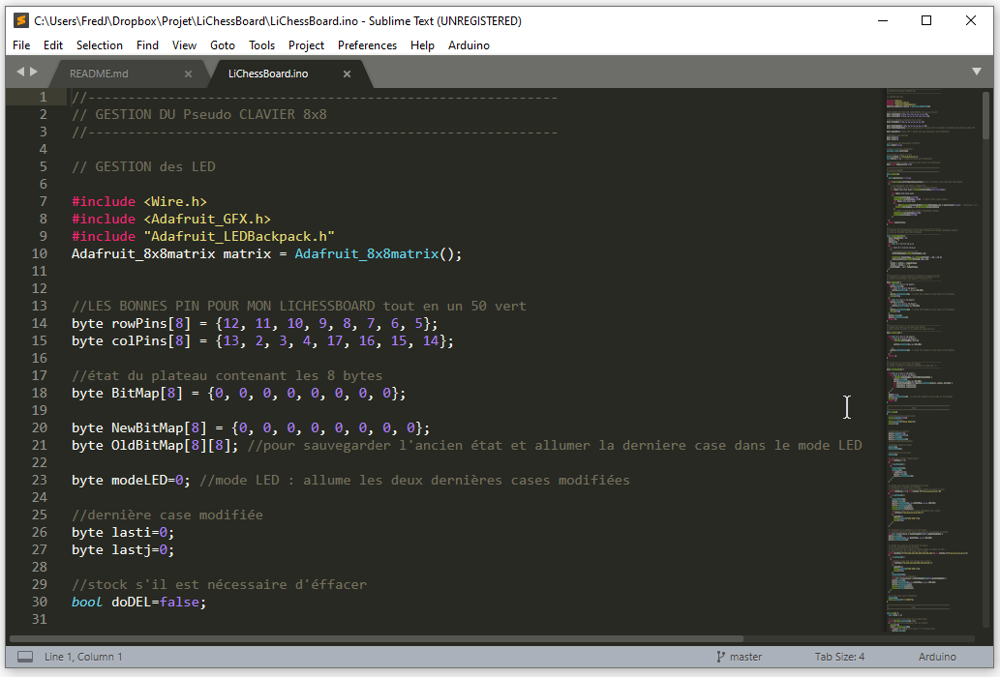

# lichessboard
ChessboARDuino with nano card and LED matrix

 

programme pour controler un lichessboard (chessboarduino + matrice de LED) 

Version qui n'utilise plus la bibliothèque Keypad pour le clavier  
nécessite les bibliothèques Adafruit_GFX et Adafruit_LEDBackpack pour la gestion des LED  
plusieurs modes  
1 pièce : la case s'allume  
2 pièces : les cases restent allumées après le passage d'une pièce  
3-16 pièces mode les cases occupées s'allument  
17-32 les cases non occupées s'allument   
4 pièces au centre zappe les étapes précédantes  
s'il manque uniquement les 4 tours activation du mode LED pour afficher le dernier coup  

